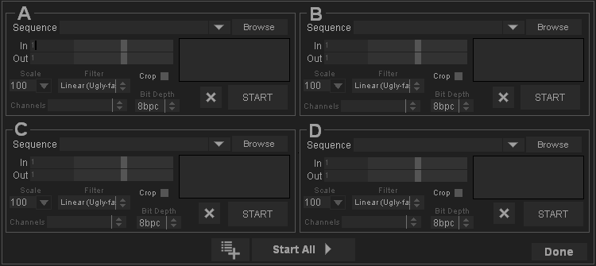
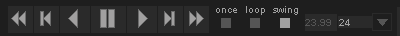
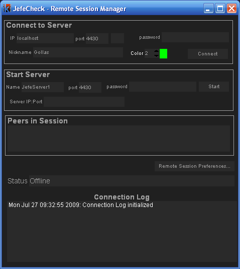

# JefeCheck Quick Reference

## Loading

### How to Load an Image Sequence into Track X

1. Open the Load Window (Menu > File > Load Sequence or `Ctrl+L`)
2. Click on the Browse button for track X
3. Navigate the file system to find your sequence and select any frame, click ok.
4. Click the Start Button in the Load Window

OR

Drag and drop a single file from the sequence into the viewport. The sequence will be loaded into whatever track is assigned to that viewport. If the Load Window is open, only the preview will be loaded until you click the START button.

OR

Drag and drop a folder into the viewport. The first sequence found will be loaded into whatever track is assigned to that viewport. If the Load Window is open, only the preview will be loaded until you click the START button.

OR

Drag and drop a single file or folder into a track in the main window.

### How to Load Only a Certain Range of an Image Sequence

1. Follow steps 1 through 3 of [How to Load an Image Sequence into Track X](#how-to-load-an-image-sequence-into-track-x)
2. Drag the In and Out sliders in the corresponding track in the Load Window
3. Click the Start Button in the Load Window

### How to Load a Sequence as a Lower Res Proxy

1. Follow steps 1 through 3 of [How to Load an Image Sequence into Track X](#how-to-load-an-image-sequence-into-track-x)
2. Before pressing Start, select or type in a scale in the Scale Box for the sequence you are loading, select the filtering you want to apply when resizing the image (linear=fast, bilinear=better looking).
3. Click the Start Button in the Load Window

OR

Drag and drop a single file from the sequence into the viewport while pressing the `Shift` key. The sequence will be loaded into whatever track is assigned to that viewport at 50%. If the Load Window is open, only the preview will be loaded until you click the START button.

### How to Load Y Number of Sequences into Several Tracks

1. Follow steps 1 through 3 of [How to Load an Image Sequence into Track X](#how-to-load-an-image-sequence-into-track-x) with up to four tracks (A, B, C and D).
2. Click the Start Button in the Load Window

### How to Load Only a Specific Region of an Image Sequence

1. Follow steps 1 through 3 of [How to Load an Image Sequence into Track X](#how-to-load-an-image-sequence-into-track-x)
2. Activate the Crop Checkbox for that track in the Load Window
3. Select the region you wish to load on the preview image shown in the Main Window. Click and Drag to move the Crop Region, Click and Drag the white corner markers to resize the Crop Region. You can zoom and pan with the left mouse button and mouse wheel.
4. Click the Start Button in the Load Window

### How to Load an Image with 16 Bit Floating Point Precision

> **Note:** This will store images in 16 bit in memory, allowing greater precision when modifying 16 bit per component images with JefeCheck's FXs at the cost of double the memory usage. You don't need to do this to simply load and playback 16 bit per component images — ONLY do it if you are experiencing problems when doing heavy processing.

1. Follow steps 1 through 3 of [How to Load an Image Sequence into Track X](#how-to-load-an-image-sequence-into-track-x)
2. Select Half Float or 16bpc from the Format Option Box in the Load Window.
3. Click the Start Button in the Load Window

### How to Cancel Loading of a Sequence

Click on the white X stop button next to the track in the Main Window. The X button will only be enabled when a track is being loaded.

### How to Start Loading a Sequence from a Certain Point in the Timeline

`Alt+Left Click` on the timeline to start reloading all tracks from that point forward. This is useful when you need to check a very long sequence but are not sure where the frames that you are interested in start and you cannot fit the whole sequence into RAM.

OR

Press `Alt+I` to set the IN point for the timeline and start loading all tracks at that point.

OR

`Alt+Left Click` on a specific track to start loading only that track from that point forward.

---

## Playback

### Change the Layout of the Viewports

Click on any of the layout radio buttons in the Main Window's Control Bar. Or use keyboard keys `1` through `4` while holding the `Ctrl` key to go through the different layouts.

### How to Change What Track Is Displayed on Each Viewport

Select the track you want to show (A, B, C or D) in the corresponding viewport's Track Option Box in the Main Window's Control Bar.

OR

Press keyboard keys `1` through `4` to select tracks A through D.

OR

Press keyboard keys `Up` or `Down` to move through the tracks.

### How to Transform a Viewport

- Left click and drag on a viewport to pan.
- Use the mouse wheel to zoom in and out. Pressing `Shift` while zooming makes the zoom 10x slower OR `Ctrl+Left Click` drag up and down for the same effect.
- If you press the `Alt` key while doing any of this, transformations will apply to all viewports (Gang Transformation).
- If you don't have a mouse wheel, you can zoom in and out by clicking and dragging the viewport's zoom box on the Main Window's control panel. From this box you can also change the pan values.
- You can also flip and flop the image by clicking on the flip and flop buttons.
- You can reset the transformation on a viewport by pressing `Ctrl+R` on your keyboard, or `Alt+R` to reset all viewports.

### How to Color Correct a Viewport

1. Select a LUT from the LUT listbox or press `Up`/`Down` while holding the `L` key.
2. Adjust Gamma by inputting a value in the Gamma box or dragging the mouse left/right while holding the `W` key.
3. Adjust Exposure by inputting a value in the Exposure box or dragging the mouse left/right while holding the `E` key.
4. Adjust Brightness by inputting a value in the Brightness box or dragging the mouse left/right while holding the `Q` key.
5. Adjust Contrast by inputting a value in the Contrast box or dragging the mouse left/right while holding the `D` key.
6. Adjust Saturation by inputting a value in the Saturation box or dragging the mouse left/right while holding the `S` key.

You can reset the color correction on a viewport by pressing `Shift+R` on your keyboard, or `Alt+Shift+R` to reset all viewports.

You can also save a favorite color correction by pressing `Ctrl+Shift+1`, `2`, `3`, `4` or `5`. Apply the color correction to another viewport at another time by pressing `Shift+1`, `2`, `3`, `4` or `5`.

OR

Apply one or more FXs like Primary Color Correction, Brightness-Contrast-Saturation, Gamma, etc.

### How to Change the Aspect Ratio of a Viewport

Select or type in an aspect ratio in the viewport's Ratio Option Box. File is the default value, which maintains the original aspect ratio of the image.

You can change the aspect ratio of the image by placing black crop bars instead of deforming it by clicking the Crop Bars Button to the left of the Ratio Option Box.

Change the opacity of the crop bars in the View Menu.

### How to See the RGBA Channels on a Viewport

Toggle through the RGBA channels by pressing the RGB button, or use shortcut keys `R`, `G`, `B`, `A`.

### How to Control the Playback

- Click on the play/pause, rewind, fast forward, back one frame and forward one frame buttons.
- Scrub the timeline by clicking and dragging the current frame notch on the timeline or `Shift+Click` and dragging on the viewport.
- Click on the Playback Mode Radio Buttons to control if you want to play the sequence once (Once) (shortcut `8`), Loop it (Loop) (shortcut `9`), or play it back and forth (Swing) (shortcut `10`).

### How to Offset a Track on the Timeline

1. Click on the more options menu button (or right click on the track) next to the track on the Main Window's Control Bar
2. Change the value of the track offset in the More Options Window for that track. You can type in a number or click and drag to change the value.

OR

Click and drag the track to move it left or right.

### How to Hold a Specific Frame on a Track

1. Click on the more options menu button next to the track on the Main Window's Control Bar
2. Select an option from the Hold Frame Option Box:
   - **Current:** Holds the current frame
   - **Edge:** When the current frame number is smaller than the first loaded frame on the track, the first frame will be shown. When the current frame number is bigger than the last loaded frame on the track, the last frame will be shown.
   - **None:** The track plays normally.

### How to Unload a Track

1. Click on the more options menu button next to the track on the Main Window's Control Bar
2. Click on the Unload Track button.

OR

Click on the unload track button from the Load Window.

### How to Show or Hide Text Information

Press the shortcut key `T` to toggle display of information text on the viewport, or press `Alt+T` to toggle it on all viewports.

If the track has a DPX, EXIF or OpenEXR metadata, it will be shown.

### How to Show DPX Metadata on the Viewport

If the track has a DPX image sequence loaded, you can display the DPX metadata for each frame by pressing the shortcut key `T` until the appropriate text display mode is activated (text display modes are none, normal and normal+metadata).

---

## Processing

### How to Load a JefeCheck FX

1. Open the FX Manager Window (`F3` or menu > Dialogs > FX Manager).
2. Click the Browse Button
3. Select one or more `.jfx` files
4. If you want to have the FX autoload next time you start JefeCheck, click on the auto-load checkbox next to the FX's name (on by default).

### How to Load a LUT

1. Open the LUT Manager Window (`F4` or menu > Dialogs > LUT Manager).
2. Click the Browse Button
3. Select a `.cube`, `.cub`, `.lut`, or `.tga` file.
4. If you want to have the LUT load automatically next time you start JefeCheck, click on the auto-load checkbox next to the LUT's name (on by default).

### How to Apply One or More FXs to a Viewport's FX Stack

1. Open the FX Control Window (`F2` or menu > Dialogs > FX Stack Manager)
2. Click on the Viewport where you want to apply the FX
3. Select the FX you want to apply from the Available FXs menu in the FX Stack Manager Window.
4. Turn the FX on or off by clicking on the on/off checkbox on the FX's controls.
5. Repeat steps 3 and 4 for each FX you want to add.

### How to Change the Position of an FX in the FX Stack

Click on the Up or Down button on the FX's controls.

---

## Remote Session

### How to Start a JefeCheck Remote Session Server

1. Open the Remote Session Manager Window (`F6` or menu > Remote Session > Session Manager).
2. In the Start Server section of the Manager fill in the necessary information:
   - Type the server's name in the Server Name Text Box
   - Type the port the server should listen on (32000 and above recommended) in the Port Text Box
   - Type a password in the Password Text Box (optional but recommended)
3. Click the Start Button

### How to Join a JefeCheck Remote Session Server

1. Open the Remote Session Manager Window (`F6` or menu > Remote Session > Session Manager).
2. In the Connect to Server section of the Manager fill in the necessary information:
   - Type the server's IP address
   - Type the port where the server you are connecting to is listening
   - Type a password in the Password field if the server requires one
   - Type in a Nickname to identify yourself in the session
3. Click the Connect Button

### How to Chat in a Remote Session

1. Connect to a Remote Session
2. Press `Y` to go into Chat Mode
3. Type in your message
4. Press `Enter` to send the message.

You can also navigate the previous messages by pressing `Up` or `Down` on the cursor keys on your keyboard.

You can exit chat mode by pressing the `Escape` key.

### How to Use Remote Pointers in a Remote Session

1. Connect to a Remote Session
2. Right click and drag anywhere on the viewport's area — everybody will see your cursor with your Nickname next to it.

### How to Save a Chat from a Remote Session

1. Connect to a Remote Session
2. Chat
3. When you are finished, click on menu > File > Save Chat Log
4. Select where you want to save your session and type a filename
