# JefeCheck User's Manual

Version 1.7 — Open Source Release

---

## Foreword

Welcome to JefeCheck! This user's manual will help you understand what JefeCheck is all about and have you using it like a pro in no time.

The manual is divided into four sections. For beginners, check out Section 1: Play. To use the more advanced features in JefeCheck look at Section 2: Process and Section 3: Share. Section 4 covers preferences, rendering, and how to build your own LUTs and FX plug-ins.

Have Fun!

Daniel Gollás, Developer of JefeCheck

---

## Introduction

### What is this software for anyway?

JefeCheck is targeted at many different people inside the film and TV industry, particularly those working with frame-based data.

The advantages of working with frame-based data are many, but a big disadvantage is the fact that there is no straightforward way of playing them back in sequence in their native format. A JPEG, for example, has no idea that it belongs to a series of files.

That is where image sequence players come into the game. But JefeCheck is a lot more than just an image sequence player!

JefeCheck has three big features: **Play**, **Process**, and **Share**.

**Play:** The core of JefeCheck. Load up an image sequence and play it back at full resolution. Load more than one — load up to four. Look at them, compare them, move them around, look closer, play them faster, play them slower, scrutinize every frame to make sure you are looking at exactly what you expected to see.

**Process:** The first thing that sets JefeCheck apart from the rest. Process your images (non-destructively of course) in any way you can think of with a powerful, easy-to-use plug-in system based on a well known shading language. Apply 3D Lookup Tables, adjust brightness, contrast, saturation and gamma, composite one sequence over another, do a preview green screen extraction and composite over a background sequence, apply primary color correction, create difference mattes, etc. All in real time and in full resolution!

**Share:** So you're having fun playing back and modifying your images, but playing alone is no fun. Fortunately JefeCheck is multiplayer! Start a remote session with any other JefeCheck-enabled computer over a local area network or over the Internet and play together. It's like being in your own virtual screening room. Everything you do is mirrored on their JefeCheck and vice versa. Text chat, plug-in and Lookup Table sharing, remote pointers and other tools help you show everybody in the remote session exactly what you want them to know.

**What JefeCheck is NOT:** JefeCheck offers a lot of image processing power to alter an image in real time, but JefeCheck is not a finishing tool. Although you can use JefeCheck to review the final output of your work, you should not rely on its image processing features to complete your work. Although it is indeed possible to render out whatever you see on the screen, you should only use these tools as means to preview your work. For example, you can do primary color correction on your frames to get an idea of changes that you would like to make using programs that you might not have immediate access to.

Using the remote collaboration capabilities of JefeCheck, someone a long distance from you might be able to give you an idea of changes that they would like to make to your sequences. But for final approval of such delicate subjects as color correction, there is really no comparison to having a real live meeting where both people are looking at the exact same monitor with the exact same color temperature, etc.

### How to read this manual

This manual is written in a way that you can read it cover to cover, but if you need to know about something in particular you can jump to any of the four sections (Play, Process, Share, or Other Stuff).

It is recommended that you understand the sections in order, since each one assumes you are familiar with the terms described in the previous one.

**Icon key — special paragraphs:**

- **Summary** — A short summary of what was just discussed.
- **Shortcuts** — Keyboard shortcut reference.
- **Power Tip** — Extra tips and useful information.

---

## SECTION 1: PLAY

In this section you will learn the basics of JefeCheck.

At its core JefeCheck is an image sequence player: it allows you to load a bunch of images named in a sequenced fashion (`image.0001.jpg`, `image.0002.jpg`, etc.) and play them back at a given frame rate.

JefeCheck allows you to load up to four different image sequences, and then watch them on screen in several different ways.

### Tracks and Viewports

There are two basic concepts you need to grasp to use JefeCheck: **Tracks** and **Viewports**. Tracks are where you load the sequences, and Viewports are where the images are actually drawn for you to see.

Although they are closely related, Tracks and Viewports are independent of each other and allow a great deal of flexibility. In a movie theater analogy, you can think of a Track as an actual film reel and a Viewport as the combination of projector and screen: a reel will always contain the same images, but depending on variables like the size of the screen or the lens on the projector, you will see the image in different ways. In JefeCheck, a Track can be seen in many different ways by adjusting the properties of the Viewport on which you are viewing it. You can even see the same track on multiple viewports with different characteristics at the same time.

You can load up to 4 different tracks at once (Tracks A, B, C and D), and then watch them on up to four different viewports (Viewport 1, 2, 3 and 4).

> **Summary:** You load sequences into tracks, and then you watch those tracks on one or more viewports.

The most basic way of using JefeCheck is to see one Track on one Viewport without changing anything else. To do this, let's first get acquainted with the basic user interface.

### Basic User Interface

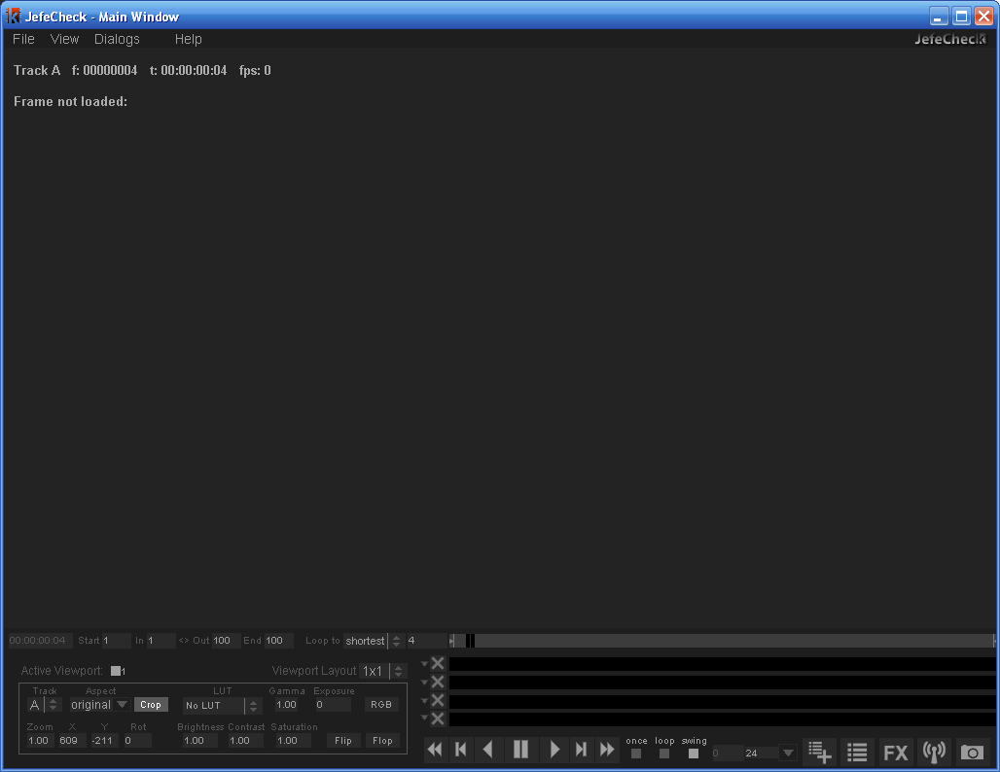

When you first open JefeCheck, you will see the **Main Window** and the **Load Window** on top. If you don't see the Load Window, you can bring it up by pressing `Ctrl+L` (L is for load). As you might have guessed, the Load Window is used to load the image sequences into tracks.

### The Load Window


The **Load Window** is divided into 4 sections. These four sections represent the four tracks into which you can load image sequences. You don't have to use all four — you can use as many as you want. Each section is exactly the same, so let's analyze what each control does.

#### Sequence Info Controls

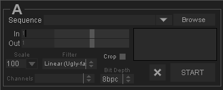

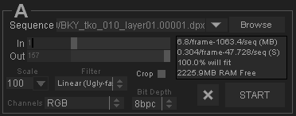

The **Sequence Info Controls** let you select what sequence you want to load. When you press the **Browse** button a file-choosing dialog appears.

From within the file chooser, you can navigate through all the folders and drives attached to your computer. To pick a sequence simply select any file that belongs to that sequence and click OK.

You can filter out the kinds of files that are shown by selecting an item in the **Show** selection box.

The bottom text box labeled **Filename** shows the current path to the selected file, and also serves as a navigation tool — click on the box above any folder in the path to go directly to that folder. You can also type the path in the filename box and use the autocomplete function by pressing `Tab`.

You can also drag and drop any frame in the sequence from your Windows Explorer, Mac Finder, or Linux file browser onto the Main Window while the Load Window is open to load a preview. If the Load Window is closed when you drag a file onto the viewport, loading of that sequence will start immediately. If you `Shift`-drag a file, it will load the sequence at 50% resolution.

If you drag a folder, the first sequence that is found will be loaded.

When working on a project, you will probably be visiting the same folder many times a day. JefeCheck lets you store **Favorites**, which are paths to folders you use frequently. To add the current folder to your favorites, click on the **Favorites** selection box and choose **Add to Favorites**. Now that folder will be available from the Favorites selection box and you can navigate directly to it by choosing it. You can also manage your favorites by clicking on the Favorites selection box and choosing **Manage Favorites**. You can also set the default browsing directory in the Preferences window.

Once you have selected the file you want and click OK, the file chooser dialog closes and the Load Window is populated with information relevant to the sequence you have chosen. The statistics box shows how much RAM memory will be used up by each frame and by the whole sequence, as well as an estimated load time based on how long the preview frame took to load.

The most recent sequences you load will be available from the **Recently Loaded** drop-down menu to the left of the Browse button.

Even though you are not familiar with the Main Window yet, you will see that the image you selected will be loaded and previewed on it, right behind the Load Window. You can get a better look at the image behind by moving the Load Window out of the way — click and drag on any gray part of the window to move it.

On top of that preview image you will also see some information on the sequence you are going to load, such as the filename, format, number of channels, bits per channel, selected frame, Keycode and SMPTE Timecode (on DPX files that contain that information), and how many frames will be loaded.

At this point, you could press the **START** button and JefeCheck would begin to load the sequence into the track for you to play. But before we do that, let's review the other options you have at load time.

#### Range Controls

The **Range Controls** let you select what part of the whole sequence you want to load. You simply select In and Out frames. The numbers you see are directly related to the numbers on the file's name. So if a sequence starts with frame number 153, the smallest value you could choose for the In frame would be 153. To select In and Out points, you simply drag the sliders on the right side of the numbers.

#### Load Time Modification Controls

The **Load Time Modification Controls** allow you to alter certain properties of the image sequence as it is loaded into a track. Changes made at load time are "baked" into the track, as opposed to Real Time Modifications which are applied "on the fly" as the picture is being drawn on the screen (you will learn about Real Time Modifications later).

Neither Real Time Modifications nor Load Time Modifications change the original file on disk in any way.

**Table: Load Time vs. Real Time Modifications**

| Load Time | Real Time |
|-----------|-----------|
| Loading a scaled image saves memory. | A scaled image uses the same amount of memory as a full-resolution one. |
| Changes are baked in and can't be reversed unless sequence is reloaded. | Changes are done to the sequence on the fly, and can be turned on and modified instantly. |
| Loading takes longer. | Loading is faster. |
| Works well on old hardware. | Runs best on newer hardware. |

Not all Load Time Modifications have a Real Time counterpart, and therefore using one type of modification should not exclude using the other. This will become clearer when we start to use and understand Real Time Modification Controls.

The Load Time Modification Controls are described below:

##### Scale

The **Scale** input box allows you to load the images as proxies of the original one. This means that the image is resampled and loaded as a lower-resolution version of itself. This saves memory and also helps performance on lower-end hardware. You can choose from common options by clicking on the pop-down menu (100%, 50%, 25%) or type in any number. When you modify the Scale value, the preview image in the main window changes accordingly.

##### Filter

This option box lets you choose between two resampling methods for when scaling an image. If you are loading the image at 100% scale, this option is irrelevant. Linear sampling is faster but produces lower-quality images, while Bilinear sampling is slower but produces smoother images. If you are not that concerned with the quality of the proxies and want faster load times, use Linear sampling; otherwise choose Bilinear.

##### Crop

Crop is a load time modification that has no Real Time counterpart, and is great for saving memory and improving performance on lower-end computers.

Crop allows you to specify a rectangular sub-section of the image you want to load, and only that part will be loaded into memory. When you enable the **Crop** checkbox, a blue overlay square will appear atop the preview image in the main window.

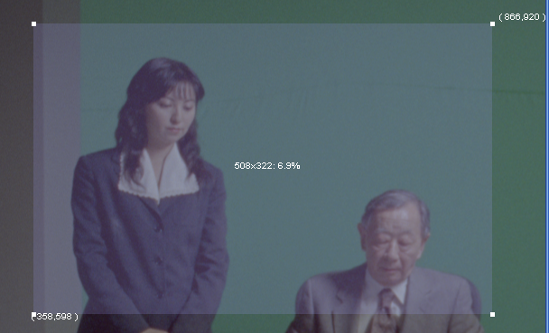 Whatever is under this square will be loaded. To move the Crop square, click and drag it; to resize the square, click and drag the corner squares.

##### BitDepth

The **BitDepth** drop-down box allows you to choose different formats to load the image into memory. The different formats have different tradeoffs:

- **8bpc** — Loads the image and transforms it to an 8-bit-per-component image to be displayed on normal monitors. This is the format you will usually use, as it offers a good balance of memory usage and provides perfect image quality unless heavy processing is applied later.

- **16bpc** — Loads images in their native bit depth and transforms them to 16-bit floating-point images. This uses up twice the amount of memory than the normal format, but allows greater flexibility during processing, preventing banding and other color artifacts when applying real-time color modifications.

- **HALF** — This image format is specific to OpenEXR image files. If you select it while loading another image format, the effect will be the same as choosing 16bpc. Loading OpenEXR images using the HALF bit depth allows JefeCheck to display the image using its native format (16-bit half-float numbers). Loading from OpenEXR files will be much faster as well, since no processing has to be done on the image. When loading using the HALF format, you will have the entire high dynamic range of the image available for processing. You will usually need to use the Gamma and Exposure controls to view it correctly, since OpenEXR pixels need gamma correction to be viewed directly on an 8-bit screen. Loading in HALF format will result in each frame using double the RAM of a normal 8bpc image.

- **4bpc** — Loads the image and transforms it into a 4-bits-per-component image. This introduces serious banding and color inaccuracies for all but the simplest images. The tradeoff is that you can fit twice as many frames into memory as you could with the normal format. One use of this format is to load as many frames as possible into memory in order to check for black or missing frames in a sequence, a process where image quality is not important.

- **S3TC** — Loads the image and compresses it in order to fit more frames into memory. Not all hardware supports this format and it is a little slower to load. The compression is not lossless and introduces a small amount of artifacts, so if you are checking for pixel imperfections, this is not the way to go. On the other hand, this format lets you fit up to eight times more frames into memory and should be used if you wish to view very long sequences where image quality does not have to be absolutely perfect (but still quite good).

Unless you are having specific problems, or you need to load more frames into memory at the expense of image quality, the 8bpc method is the recommended format for most uses (except for EXR images, in which case the HALF format is recommended).

##### Channels

This option box lets you choose between any available channels present in the image. This is particularly useful for OpenEXR files. If you open a multi-channel OpenEXR image, all the contained channels will be shown here so you can choose which one you wish to load into the track (e.g., Specular, Diffuse, RGBA, Y, Shadows, Depth, etc.).

#### Start All and Playlist Buttons

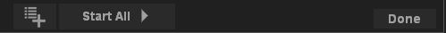

Once you have selected what tracks you want to load, adjusted their load-time parameters (if needed), and you are sure of what you want to load, hit the **START** button. This will start loading the track in the background and you can continue using the Load Window to load another sequence into another track. If you set up all the tracks and want to start loading them all at the same time, click the **Start All** button at the bottom of the Load Window. This closes the Load Window and the sequences will start loading into the tracks. If you decide you don't want to do anything, you can simply click the **Done** button to close the Load Window.

The **Add to Playlist** button adds the current setup to the playlist. To display the playlist, press `Ctrl+P`.

> **Summary:** You use the Load Window to select what tracks you want to load, adjust how you want them to be loaded, and then click the START button to start loading. All parameters have the most common values as defaults, so loading can be as fast as selecting a sequence and clicking START. Remember you can also drag a frame of the sequence onto any viewport in the Main Window to load the sequence.

---

### The Main Window

The **Main Window** is where almost everything else in JefeCheck really happens. It is basically divided in three: the **Menu Bar**, the **Viewports Area**, and the **Control Bar**.

- The **Menu Bar** is where you access other windows or adjust some settings.
- The **Viewports Area** is where the viewports are located and you actually see the image sequences you have loaded.
- The **Control Bar** is where you control almost everything related to the playback of the sequences you are watching and adjust many settings for the viewports.

You can hide the Control and Menu Bars by pressing `Ctrl+Alt+F`. You bring the controls back up by pressing `Ctrl+Alt+F` again.

When you first see the Main Window, it is empty. What is shown in the Viewports Area varies depending on what windows are open, but this is the area where you will see all of the graphical data that JefeCheck can show.

When the Load Window is open, you will see a preview of the sequences that will be loaded if you click the START button. When the Load Window is closed, you will see whatever track is loaded and assigned to each particular viewport.

Remember: tracks are independent from viewports — tracks hold sequences, and viewports are used to view those sequences. One viewport can show only one sequence, but one sequence can be seen on multiple viewports.

---

### The Control Bar

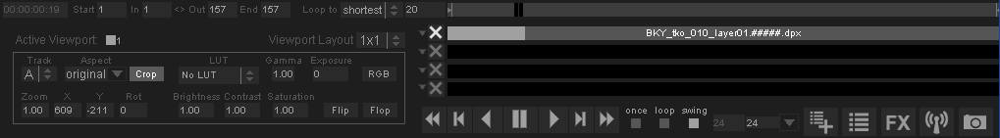

The Control Bar contains many different controls grouped into three logical areas:

1. Timeline and Track Controls
2. Viewport Controls
3. Playback Controls

#### Timeline and Track Controls

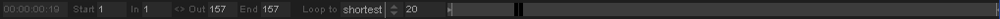

The **Timeline and Track Controls** show you information relevant to time and position of what you are seeing on the screen, and they let you control what frames of the loaded sequences you are looking at.

The Timeline controls from left to right are:

**SMPTE Counter** — Shows the current time relative to the timeline starting at frame one. It does not show timecode information embedded in files. The counter shows time as `HH:MM:SS:FF`. The number of frames that must elapse for the seconds counter to increase depends on the target frame rate, controlled from the Playback Controls.

**From/To — In/Out Markers** — The From and To markers specify the range of the timeline. You can force the timeline to play back only from a certain frame and up to another one using the In/Out markers. This is helpful if you only want to see a certain range of frames of the sequence at a time. This is different from only loading a certain range of frames, since you can change the From and To markers on the fly without having to unload or reload any frames. As with all numeric inputs in JefeCheck, you can click and drag to change the value or enter a number with the keyboard. You can also use `i` and `o` to set the In and Out points. To reset them use `Shift+I` and `Shift+O`. If you do `Alt+I`, the In point will be set and the sequence will start reloading from that point on. You can also click and drag the In/Out markers directly on the timeline. Whenever you load a sequence, the From/To and In/Out markers are updated to fit the longest loaded sequence.

**Loop Priority Control** — When you have multiple tracks loaded, each with a different length, the loop priority determines at what point on the timeline the playback will loop. The options are:

- **Shortest** — The playback loops around the sequence with the shortest number of loaded frames. This could mean not seeing all of the frames in the longer sequences.
- **Longest** — The playback loops around the sequence with the longest number of loaded frames. This could mean seeing empty frames in the shorter sequences.
- **Timeline** — The playback loops around the length of the timeline, no matter how many frames are loaded in any track.

**Current Frame** — Shows the current frame the timeline is at.

**The Timeline** — Allows you to control and graphically visualize what frame of the sequence you are looking at. You can click and drag the knob on the timeline to scrub or jump to any point on it. The size of the knob will vary depending on the range the timeline is showing, as defined by the From and To markers.

**Track Controls** — There are four rows of controls under the Timeline, one for each track. Each row contains a **Track Options Button**, a **Cancel** button, and a **Track Bar**.

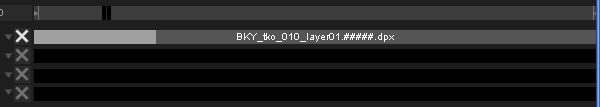

- **The Track Bar** — A gray background showing how long the track is in relation to the timeline and other tracks.

  

  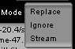 Inside the gray background there is a slightly darker gray area that shows the range of the track we wish to load. That range area lights up in green to show what frames are loaded in memory and ready to show. While a track is loading, you can play back whatever part is already in memory.

- **The Cancel Loading Button** — Turns red whenever its corresponding track is being loaded, allowing you to cancel the load at any point. When the track is completely loaded or no more frames can fit into memory, loading stops and the button turns gray.

  

- **The Track Options Button** — When you click on the Track Options button, a **Track Options** window appears with the following options:

  - **Frame Offset** — Allows you to offset the track a certain number of frames in relation to the timeline and other tracks. This is useful if you are comparing two tracks but the segment you wish to compare is not in the same frames on both tracks. You can also change the frame offset by clicking and dragging the track bar.

  - **Hold Frame** — Specifies what should be displayed if the current frame is outside of the loaded frames for a particular track. Options are:
    - **None** — No frame will be held. If the timeline goes out of the range of the sequence, no frame will be shown.
    - **Current** — The track will always show the frame that was current when the Current option was selected.
    - **Edge** — Whenever the current timeline frame is out of the range of loaded frames, the one on the closest edge will be used: if the timeline is at a later frame, the last loaded frame will be shown; if earlier, the first loaded frame will be shown.

  - **Unload Track** — Unloads the track to free memory. All settings are kept in the Load Window so the track will be reloaded next time you start a load. To unload the track and erase the settings, use the Unload button in the Load Window.

You can also reach the Track Options menu by right-clicking on the track.

Many times a whole sequence won't fit into memory. You can tell JefeCheck to unload the loaded frames and start loading the sequence from a different point by `Alt`+right-mouse-button-clicking on the track at the point where you would like to start loading. If instead of `Alt`+right-clicking on the track bar you do it on the timeline, then all tracks will unload and start loading from that point on.

> **Summary:** You use the Timeline controls to change the timeline range and current timeline frame, which controls what is displayed for each track according to its own settings. You can also use the track bars and timeline to start loading frames at a particular point.

#### Playback Controls


The **Playback Controls** let you control and decide how the timeline is to behave.

| Control | Action | Shortcut |
|---------|--------|----------|
| Rewind | Returns to first frame | `Z` |
| One Frame Back | Move one frame back | `X` or `Left Arrow` |
| Play/Pause Reverse | Play or pause in reverse | `,` |
| Pause | Play or pause in current direction | `Space` |
| Play/Pause Forward | Play or pause forward | `.` |
| One Frame Forward | Move one frame forward | `C` or `Right Arrow` |
| Fast Forward | Jump to last frame | `V` |

The keyboard shortcuts may seem a little unusual, but if you position your left hand with your thumb on the Space bar and your pinky finger on the `Z` key, your other fingers will fall right in place with the other playback control keys, allowing you to start/pause playback, fast forward, rewind, and advance frames with very little effort — all while leaving your right hand free to control the viewports.

**Loop Modes** — Control what happens when the current timeline value reaches its limit:

- **Once** — The sequence plays once and then stops on the last frame. Shortcut: `8`.
- **Loop** — The sequence plays forward in an infinite loop until paused. Shortcut: `9`.
- **Swing** — The sequence plays forward, and when it reaches the last frame it plays in reverse, going back and forth until paused. Shortcut: `0`.

**Actual Frame Rate** — Shows the actual frame rate the sequence is running at. Due to hardware limitations the playback frame rate may not match the target frame rate.

**Target Frame Rate** — JefeCheck will try to maintain this frame rate during playback. You can type in any integer value or click the drop-down menu to select commonly used frame rates.

You can also scrub the timeline by clicking and dragging on the viewport while holding the `Shift` key.

> **Summary:** You use the Playback controls to start/pause playback, determine the target frame rate, monitor the actual frame rate, and select if and how you want the sequence to loop.

#### Viewport Controls

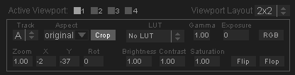

The **Viewport Controls** allow you to specify and control what viewports will be shown, and what track each viewport will display.

**Viewport Layouts:**

- **1x1** — A single viewport (Viewport 1) using all the space in the viewport area. Shortcut: `Ctrl+1`.
- **2x1** — Two viewports side by side, each using half the horizontal space and full vertical space. Shortcut: `Ctrl+2`.
- **1x2** — Two viewports one on top of the other, each using half the vertical space and full horizontal space. Shortcut: `Ctrl+3`.
- **2x2** — Four viewports, two side by side and another two under them. Shortcut: `Ctrl+4`.

You can also access layouts from the keyboard or from **View > Viewport Layout** in the Menu Bar.

The controls shown correspond to the active viewport. To activate a viewport, select it in the Active Viewport checkboxes or click on it in the viewport area.

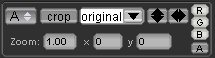

**Per-Viewport Controls:**


**Track Selection Box** — Select which track you want displayed on this viewport. It can be any of the four tracks. If no sequence is loaded in the selected track, the viewport will not show anything. More than one viewport can show the same track at the same time.


**Aspect Ratio Controls** — You can change the aspect ratio of the sequence being shown on the screen in real time. The default value is **original**, which uses the original aspect ratio of the image. The drop-down menu shows commonly used aspect ratios such as 4:3, 16:9, 2.35:1, etc., but you can type in any ratio using `x:y` notation or as a decimal.

By default, when you change the aspect ratio, the image will be deformed to adapt to it. This is useful when viewing material filmed with anamorphic lenses.

When you activate the **Crop Bars** control and the Aspect Ratio is set to anything other than "original", the aspect ratio will be changed not by squashing or stretching the image but by applying black crop bars to hide or compensate for a portion of the image. The opacity of the black aspect bars can be changed in **View > Aspect Bars opacity**.


**Flip/Flop Controls** — Reflects the viewport vertically (Flip) or horizontally (Flop) or both. Shortcuts: `Ctrl+8` (flip) and `Ctrl+9` (flop).

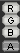

**RGBA Mask** — View any RGB color channel of the image by clicking the RGB color mask button, which toggles through each channel. Shortcuts: `R`, `G`, `B`, and `A`.

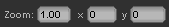

**Transformation Controls** — Zoom in and out using the scroll wheel, or use the zoom control (1 = no zoom). You can also zoom by holding `Ctrl` and left-clicking and dragging on the viewport. Pan by left-clicking and dragging on the viewport, or use the X/Y position controls (0 = centered). You can also rotate the frame an arbitrary number of degrees. To reset transformations use `Ctrl+R`, or `Alt+Ctrl+R` to reset all viewports.

**Color Correction Controls** — Adjust several color aspects of the viewport. Applied in the following order:

- **LUT** — Apply a 1D or 3D LUT to the viewport. Loading LUTs is described in Section 2. To scroll through available LUTs use `Ctrl+Up/Down`. You can select a default LUT in the **LUT Manager** (shortcut `F4`). This default LUT can be overridden by setting the environment variable `JEFECHECK_DEFAULT_LUT` to the name of the desired LUT.
- **Gamma** — Adjust screen gamma. Shortcut: hold `W` and click-drag on the viewport.
- **Exposure** — Adjust screen exposure. Shortcut: hold `E` and click-drag on the viewport.
- **Brightness** — Adjust screen brightness. Shortcut: hold `Q` and click-drag on the viewport.
- **Contrast** — Adjust screen contrast. Shortcut: hold `D` and click-drag on the viewport.
- **Saturation** — Adjust screen saturation. Shortcut: hold `S` and click-drag on the viewport.

To reset the viewport's color corrections click `Shift+R`.

If you use a color correction frequently, you can save it as a **Color Correction Favorite** in one of 5 slots. Click `Ctrl+Shift+1` through `Ctrl+Shift+5` to save. Click `Shift+1` through `Shift+5` to apply a favorite color correction to the active viewport. Favorite color corrections are saved in the settings file and will be available next time you open JefeCheck.

> **Summary:** You use the layout controls to change how many viewports are displayed and how they are laid out. You use the viewport controls to change the way each viewport is drawn — aspect ratio, zoom, and which track is displayed. You use the color correction controls to change the color properties of the viewport, with the ability to save and load up to 5 favorite color corrections.

---

### The Viewports Area

The central area of the Main Window is the **Viewports Area**. This is where the image sequences and other bits of information are drawn. The viewport area will be divided into up to four sections, depending on the layout chosen.

The sections are not divided by a visible divider, but each viewport has a text overlay that shows valuable information on what is being shown at the moment.

#### Viewport Behavior

Viewports show different information depending on what you are doing at the moment.

**With the Load Window Open:**

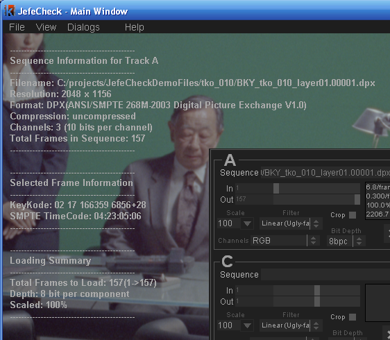

When the Load Window is open, each visible viewport shows a preview frame for each sequence that will be loaded into each track. Each viewport shows the preview for whatever track it is assigned to.

Additionally, the text overlay on each viewport will show:

- What track the preview is for
- The filename of the image being displayed (and the source for the sequence)
- The image's resolution in pixels (Width × Height)
- The image's format with a description (if available)
- The image's compression method (if any)
- How many channels (components) are in the image
- How many bits per channel the image has
- The total number of frames identified in the sequence
- KeyKode and SMPTE Timecode information (only available in DPX images that contain such metadata)
- A loading summary showing the total number of frames to be loaded, start and end frame numbers, the bit depth, and the scale

**During Playback:**

Once sequences are loaded and the Load Window is closed, you will see the frames in the selected layout.

The text overlay can toggle between three states by pressing `T`: no display, basic information, and basic plus metadata

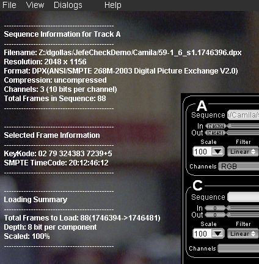 (if the track contains DPX, OpenEXR, or EXIF metadata). Press `Alt+T` to toggle the text display for all viewports.

Basic mode shows:

- The current timeline frame (e.g., `f:0000086`)
- The current SMPTE time relative to the first frame (e.g., `t:00:00:03:14`)
- The current playback frame rate (e.g., `fps:24.00`)
- The filename of the image being shown
- The image resolution, number of channels, and bits per component (e.g., `2048x1156x3 10bpc`)

When DPX metadata is present and enabled, the following additional fields are shown:

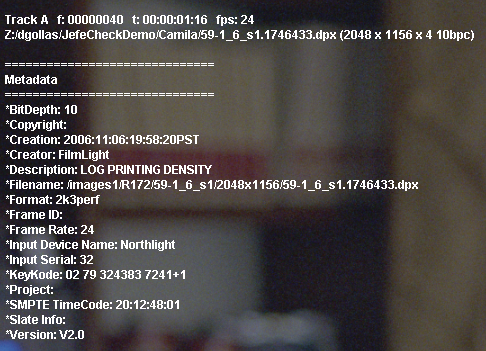

- Timecode (from the DPX TV Header)
- KeyKode (derived from the DPX Motion Picture Header)
- Filename (from DPX File Information Header)
- Source Filename (from DPX Image Orientation Header)
- Frame ID (from DPX Motion Picture Header)
- Project (from DPX File Information Header)
- Slate (from DPX Motion Picture Header)
- Creator (from DPX File Information Header)
- Input Device (from DPX Image Orientation Header)
- Input Serial (from DPX Image Orientation Header)
- File Size in MB, KB and Bytes (from DPX File Information Header)
- Frame rate (from DPX Motion Picture Header)
- Format (from DPX Motion Picture Header)
- Creation Time (from DPX File Information Header)
- Source Creation Time (from DPX Image Orientation Header)
- Copyright (from DPX File Information Header)

For OpenEXR images, the metadata shown is:

- Focus Distance
- Exposure Time
- Lens Aperture
- ISO Speed
- KeyKode
- Timecode
- Location (Longitude, Latitude, Altitude)

For images with EXIF metadata, all available fields will be displayed.

**LUT Visualization:**

The viewports can also show a graphical representation of a 1D or 3D Lookup Table. See Section 2: Process for more information.

#### Viewport Interaction

Using the mouse and keyboard you can interact with the viewports to modify their parameters and obtain information about what is being displayed.

| To do this... | ...do this |
|--------------|------------|
| Scrub the timeline | Click and drag left or right on the viewport while holding `Shift`. |
| Zoom in and out | Move the mouse wheel up or down. Pressing `Shift` makes zoom act 10× slower. Optionally, left-click and drag up and down while holding `Ctrl`. |
| Gang Zoom (all viewports) | Zoom as normal but also press `Alt`. |
| Pan | Left-click and drag on the viewport. |
| Gang Pan (all viewports) | Left-click and drag while holding `Alt`. |
| Reset viewport transformations | Select the viewport and press `Ctrl+R`. |
| Reset all viewport transformations | Press `Ctrl+Alt+R`. |
| Adjust Gamma | Left-click and drag while holding `W`. |
| Adjust Exposure | Left-click and drag while holding `E`. |
| Adjust Brightness | Left-click and drag while holding `Q`. |
| Adjust Contrast | Left-click and drag while holding `D`. |
| Adjust Saturation | Left-click and drag while holding `S`. |
| Reset viewport color corrections | Select the viewport and press `Shift+R`. |
| Reset all color corrections | Press `Shift+Alt+R`. |
| Color picker (show pixel value) | Right-click on the viewport while pressing `Ctrl`. |

> **Summary:** The Viewport Area is where you will see the Viewports displaying all the information contained in the tracks. You can interact with the Viewports using the mouse and keyboard and display text information on what you are looking at, including DPX, OpenEXR and EXIF metadata when present.

---

### The Menu Bar

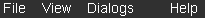

At the top of the Main Window is the **Menu Bar**, from which you can access settings that modify the way the program behaves and the viewports are displayed. Most menu items have a keyboard shortcut displayed next to them.

#### File Menu

- **Load Manager** (`Ctrl+L`) — Opens the Load Manager Window.
- **Playlist Manager** (`Ctrl+P`) — Opens the Playlist Window.
- **Save Session** (`Ctrl+S`) — Saves a complete JefeCheck session including loaded tracks, load-time parameters, and viewport configurations into a single file for later recall.
- **Open Session** (`Ctrl+O`) — Opens a complete JefeCheck session, replacing any current sequence settings and loaded tracks.
- **Save Chat Log** — Saves the complete chat log after a remote session.
- **Preferences** (`Ctrl+P`) — Opens the Preferences Window. See Section 4: Other Stuff.
- **Quit** (`Ctrl+Q`) — Quits JefeCheck.
- **Recent Sessions** — Shows the last few loaded sessions.

#### View Menu

- **Viewport Layout** — Change the layout of the viewports.
- **Zoom Filtering** — Choose between a **Point Filter** (see every pixel when zoomed in) or a **Bilinear Filter** that smoothes the image.
- **Aspect bar opacity** — Select the opacity for aspect bars overlaid on the image when the aspect ratio is modified.
- **Fit to viewport** (`F`) — Find the best fit for the current frame in the viewport. Smaller images will not be enlarged, but large images will be zoomed out.
- **Fit all to viewport** (`Alt+F`) — Fit frames in all viewports.
- **Flip** (`Ctrl+8`) — Flip viewport vertically.
- **Flop** (`Ctrl+9`) — Flop viewport horizontally.
- **Flip All** (`Alt+Ctrl+8`) — Flip all viewports vertically.
- **Flop All** (`Alt+Ctrl+9`) — Flop all viewports horizontally.
- **Reset Current View** (`Ctrl+R`) — Resets the current viewport's transformations.
- **Reset All Views** (`Ctrl+Alt+R`) — Resets all viewport transformations.
- **Reset Current Color Correction** (`Shift+R`) — Resets the current viewport's color corrections.
- **Reset All Color Corrections** (`Shift+Alt+R`) — Resets all viewport color corrections.
- **Show Histogram** (`Ctrl+H`) — Shows an RGB histogram for the current viewport. You can drag and resize the histogram within the viewport.
- **Fullscreen** (`Ctrl+F`) — Toggles full-screen mode on or off. If you have two monitors, full-screen mode activates on the monitor where the JefeCheck main window is located.
- **Hide Controls** (`Ctrl+Alt+F`) — Hides the control and menu bars. Most keyboard shortcuts will work when in this mode. To return to normal mode, press `Ctrl+Alt+F` again.

#### Dialogs Menu

- **Load Manager** (`Ctrl+L`) — Opens the Load Manager Window.
- **Playlist Manager** (`Ctrl+P`) — Opens the Playlist Window.
- **FX Stack Manager** (`F2`) — Opens the FX Stack Manager Window. See Section 2: Process.
- **FX Manager** (`F3`) — Opens the FX Manager Window. See Section 2: Process.
- **LUT Manager** (`F4`) — Opens the LUT Manager Window. See Section 2: Process.
- **Remote Session Manager** (`F5`) — Opens the Remote Session Manager Window. See Section 3: Share.
- **Render Manager** (`F6`) — Opens the Render Manager Window. See Section 4: Other Stuff.

#### Help Menu

- **Help** (`F1`) — Displays this user manual.
- **Quick Start Guide** — Shows the Quick Start Guide.
- **Online Support** — Takes you to the JefeCheck support page.
- **Video Tutorials** — Takes you to the JefeCheck video tutorials page.
- **Toggle On-screen Help** (`H`) — Displays/hides quick help shortcuts on the viewport area.
- **Check System Requirements** — Displays a window showing what JefeCheck features are available on your hardware.
- **About JefeCheck** — Shows the About window containing version, contact, and credits information.

---

### Playlists

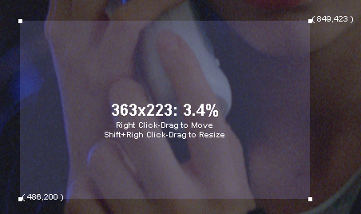

**Playlists** allow you to save a series of "Playlist Items" and then recall them at will. A playlist item is NOT a single sequence — it holds much more information, including what sequences are loaded in what tracks and with which parameters, the viewport layout, playback settings, and any FX stacks applied to the viewport. This way, jumping from one setup to another is a snap.

For example, you might be reviewing a series of shots for a show. Say for shot 1 you load the original scans in Track A and the completed shot in Track B. You apply a blend FX between them and show it in a side-by-side layout. You then add this to a playlist. All the settings will be recalled whenever you double-click on that item, not just what was loaded into Track A.

> **Power Tip:** You can think of a playlist item as a snapshot of the current state of JefeCheck.

To open the Playlist Window, use `Ctrl+P` or use the Dialogs Menu.

You add items to a playlist in three ways:

1. From the Load Window's **Add to Playlist** button.
2. From the Main Window's **Add to Playlist** button.
3. By dragging a single file from the sequence into the Playlist window. If you drag more than one file, each one will be considered a sequence and loaded into different tracks.

Whatever way you choose to add an item to the playlist, the state of the application (viewport layout, FXs, playback settings) will be saved with the item.

You can append tracks to a playlist item by dragging a single file in the sequence onto the playlist item in the Playlist Window. It will be added to the first available track in the item.

To load a playlist item, double-click on it or select it and press `Enter`.

You can move items by selecting them and pressing `Shift+Up` or `Shift+Down`.

Keep in mind that only items loaded from the Playlist Window will be loaded in remote sessions (see Section 3: Share).

Playlists can be saved using the Playlist Menu in the Playlist Window. Click **Save Playlist** and choose a path and filename — the file will be saved with a `.jpl` extension. To load a playlist, use **Load Playlist**, or drag it into the Playlist Window or the Main Window's viewport area. You can load more than one playlist at a time; their items will be appended.

You can clear a playlist using **Clear Playlist**, which removes all items from it.

---

## SECTION 2: PROCESS

In this section you will learn how to load and use LUTs and JefeCheck FXs.

One of JefeCheck's most powerful features is the ability to process the image sequences you are watching with a variety of Lookup Tables and other effects. JefeCheck uses a simple plug-in system to control how the images are processed.

### Real Time Modifications vs Load Time Modifications

As mentioned in Section 1, there are two ways to process an image in JefeCheck: at Load Time and in Real Time. Continuing the film analogy from Section 1, tracks are like film reels, and viewports are a combination of projectors and projection screens.

You can think of Load Time Processing as making a different print of the film reel — maybe you crop the image, maybe you print it at a different size. No matter how much you adjust the projector lenses or filters, the images on that different print will be changed, and what you see on screen won't go back to normal until you reload the original print.

In contrast, Real Time Modifications are equivalent to loading the original film reel on the projector and then putting different filters or lenses on it. You don't have to make a different print in order to see a different effect — you simply swap one filter for another, but the reel remains the same.

In JefeCheck, Load Time Modifications are done in the Load Window. Real Time modifications are applied on the fly using the power of your computer's graphics card.

JefeCheck can load a variety of Lookup Table formats, but the easiest way to get a 3D LUT is to make your own. It is really easy to emulate any color look by using a custom-made JefeCheck LUT. If you can render a single frame through your color pipeline, then you can use the color output of that pipeline in JefeCheck! All you do is process the provided calibration image (`JefeCheckLUTSourceImage.tga`) through your pipeline — the resulting image (which should be the same size as the original) is loaded into JefeCheck and converted to a 3D Lookup Table that will emulate whatever color alterations your pipeline made to the original image. See Section 4: Other Stuff to find out how to make your own 3D LUT.

You can also load and use 1D LUTs. The file format for a 1D LUT is a simple text file. To learn how to write your own 1D LUT see Section 4: Other Stuff.

JefeCheck also understands Truelight `.cub` 3D cube files and has been tested with cubes of size 16 and 32, but should work with any size.

CMS cubes rendered from The Foundry's Nuke are similar to JefeCheck's 3D LUT images and are also supported for cubes of size 16 (these are images with a resolution of 448×448 pixels). You should render out the image as a TGA file with linear color space conversion.

To load a LUT, be it 3D or 1D, you use the **LUT Manager**.

---

### The LUT Manager Window

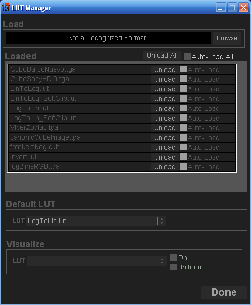

From the **LUT Manager** (`F4` or **Dialogs > LUT Manager**) you can load and unload LUTs.

The first time you open the LUT Manager, it will be empty, so you need to load whatever LUTs you intend to use. To load a LUT, click the **Browse** button — this opens a file browser where you can select any supported LUT format. You can select multiple LUTs at once by dragging or `Ctrl`-clicking. The LUT browser navigates by default to the FX folder in your JefeCheck installation, which is where your LUTs should be stored.

Once you have selected one or more LUT files and click OK, JefeCheck will start loading. If the LUT was correctly loaded, the progress bar will turn green.

The LUT will appear in the **Loaded LUTs** section. You don't have to load a specific LUT every time you need it — check the **Auto-Load** checkbox next to a loaded LUT to have JefeCheck automatically load it next time you open the program.

You can load as many LUTs in as many different formats as you want. Unload them by pressing the **Delete** button next to each one. This only unloads them from memory — it does not delete them from disk.

#### Default LUT

You can have a default LUT that is applied to all viewports whenever you open JefeCheck. You can override this setting by setting the environment variable `JEFECHECK_DEFAULT_LUT` with the name of the LUT (e.g., `LogToLin.lut`). Make sure that you use the name of a LUT that has previously been loaded.

#### Visualizing LUTs

JefeCheck can show you a visual representation of loaded LUTs, be they 1D or 3D. To visualize a LUT, check the **On** checkbox in the Visualization Section of the LUT Manager and select the LUT you want to visualize. You will see the LUT drawn on a viewport in the Main Window. Use the same controls you normally use to pan and zoom a viewport to navigate the LUT visualization.

**1D LUTs** are plotted on an X/Y plane, with the input value on the X axis and the output value on the Y axis. A grayscale value of the output is used to color each point in the plot. Text labels of a subsample of the values are also drawn showing input and output values.

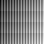

**3D LUTs** are displayed as color cubes, placing a colored point at each sample in 3D space. A canonical 3D LUT generates a perfect color cube, while a modified cube displays other characteristics.

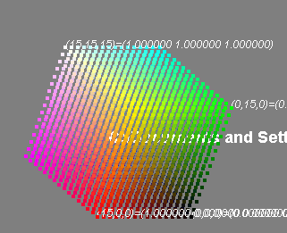

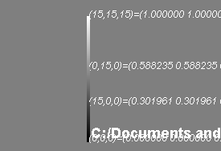 Each point in the LUT is positioned in 3D space corresponding to its output RGB value, and is colored with that same information. If you click the **Uniform** checkbox, the samples will be spaced uniformly forming a perfect cube, but points will still be colored with their output values — this lets you compare two cubes without being distracted by geometric deformations.

#### Using LUTs

Real Time modifications are called **FXs** within JefeCheck. Each FX comes in the form of a plug-in that must be loaded in order to be used. JefeCheck comes with two FXs for LUT application: one for 1D LUTs and one for 3D LUTs. See Section 4: Other Stuff for an explanation of the included FXs.

---

### The FX Manager Window

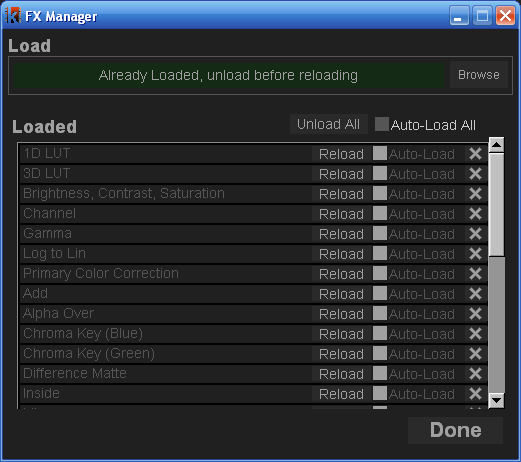

From the **FX Manager** (`F3` or **Dialogs > FX Manager**) you can load and unload FXs.

When you first open the FX Manager, it will be empty. To load an FX, click the **Browse** button. This opens a file browser in the default FX folder within your JefeCheck installation. Select one or more `.jfx` files and click OK. If everything goes OK, a confirmation message appears and the FX will be listed in the Loaded section. Check the **Auto-Load** checkbox next to each FX to have them load automatically next time you use JefeCheck. To unload an FX, click its Unload button.

---

### The FX Control Window

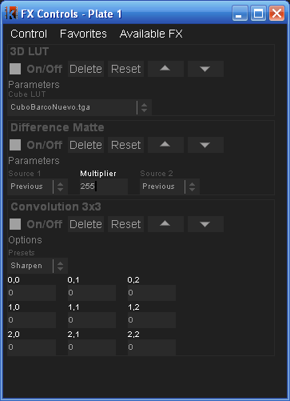

You use FXs by applying them to viewports. A viewport can have no FX applied, or as many as your graphics card performance will allow while maintaining a desired playback frame rate. To apply an FX, use the **FX Stack Manager** (`F2` or **Dialogs > FX Stack Manager**). You can also click the FX button on the Main Window's Control Bar.

FXs are applied to each viewport independently — you can have one viewport playing back the unprocessed sequence while on another viewport you have the sequence playing with a LUT or Primary Color Correction applied.

To apply an FX to a viewport, open the FX Stack Manager (`F2`) and click on the viewport you wish to use. The FX Stack Manager title will change to show what viewport is selected (e.g., **FX Controls Plate 1** means you are working on Viewport 1). An **Available FX** submenu will appear on the window's menu bar from which you can select what FX you wish to apply. To switch viewports, simply click on the desired viewport.

Once you click on an FX from the Available FX menu, it appears on the **FX Stack**. FXs are applied in the order they were added to the stack, so the output of one FX is passed to the one below it.

#### Common FX Controls

All FXs have a set of common controls:

- **On/Off** — Turns the FX on or off. This lets you compare with and without the effect without having to delete and re-apply it.
- **Delete** — Removes the FX from the FX stack.

  
- **Reset** — Returns all FX parameters to their default values.
- **Move Up/Down** — Moves the FX up or down the stack.

Most FXs have parameters you can customize. As with almost all other numeric input fields in JefeCheck, an FX's numeric parameters can be modified in two ways: by typing a number, or by clicking and dragging with the mouse. The value changes based on mouse movement at a rate dependent on which button you click:

- **Left mouse button** — Finest precision (smallest decimal step)
- **Middle mouse button** — 10× rate
- **Right mouse button** — 100× rate

#### Performance

A viewport can have many FXs stacked one on top of the other. You can apply an arbitrary number of FXs, but the performance and frame rate will vary depending on your graphics hardware. When selecting graphics cards, the key spec to look for is the number of Pixel Shaders or Pixel Units (called Stream Processors on newer cards) — the more of these a graphics card has, the better FX stack performance will be.

Tests have shown very good performance on mid-range gaming-level video cards with more than 5 FXs applied on a 2K resolution sequence.

#### FX Control Window Menu

The FX Control Window has its own menu bar consisting of:

- **FX Manager** — Opens the FX Manager Window.
- **Clear All** — Removes all FXs from the stack.
- **Save Stack** — Saves a stack with all FXs and their settings to a file with a `.fxs` extension. You can later apply this same stack to another viewport or a different sequence.
- **Load Stack** — Loads a previously saved `.fxs` stack file. The FXs need to be loaded for Load Stack to work; otherwise you will get a message stating what FX is missing. Note that when loading a stack, the FXs will be **added** to the current stack. To replace the current stack, clear all FXs first.

**Favorites** — The Favorites menu allows you to save an FX stack and recall it with a single keystroke. There are 5 favorite slots available, each of which can contain a complete FX stack with parameters.

- Save the current FX stack to a favorite: use **Favorites > Save Stack To > slot number**, or use `Ctrl+Shift+F1` through `Ctrl+Shift+F5`.
- Recall an FX favorite: use **Favorites > Load > slot number**, or use `Shift+F1` through `Shift+F5`.
- Append a favorite to the current stack: use **Favorites > Append > slot number**, or use `Ctrl+F1` through `Ctrl+F5`.

---

## SECTION 3: SHARE

In this section you will learn how to start and participate in a JefeCheck Remote Session.

In the previous sections you learned how to use JefeCheck to play sequences and process them using FXs. The last big feature of JefeCheck is the ability to do all that in collaboration with people who might be miles away.

Collaborating with other people over a network connection or the Internet is called a **Remote Session** in JefeCheck.

### Remote Sessions

When two or more people have a JefeCheck Remote Session, each participant has a copy of JefeCheck running on their computer, along with a local copy of the sequences that will be loaded for playback. JefeCheck does not send any image information over the network, for two reasons:

1. Sending image information requires great amounts of bandwidth that might not be available to all participants.
2. Even if everybody had sufficient bandwidth, sensitive content such as frames from an unreleased movie is usually copied and sent on a need-to-have basis through specialized, controlled, and secured channels managed by a data wrangler.

A JefeCheck Remote Session requires at least two participants, one of whom will act as a Session Server. The process can be summarized in three steps:

**Step 1 — Start a Server:** One participant, usually the one with the fastest connection and best computer, starts a server from JefeCheck. This participant will need to have an IP address that other players can access from their network, normally called a Public Address if the session is being held over the Internet. If you don't have a public IP address you will not be able to host a remote session over the Internet. This is not an issue when starting a server for a session over a local network or a VPN.

**Step 2 — Other Participants Connect to the Server:** Once the server is started, the server's IP address and port is communicated to other participants — over the phone, email, instant messaging, or whatever method you prefer.

**Step 3 — Play!** When everybody has connected to the server, anything someone does on their copy of JefeCheck will be mirrored on everybody else's copy, including the server.

Everything involved in setting up or joining a Remote Session is done from the **Remote Session Manager Window**.

### The Remote Session Manager


To start or join a remote session, open the **Remote Session Manager** (`F5` or **Dialogs > Remote Session Manager**).

#### Connecting to a Server

In order to connect to a JefeCheck remote server that is already online:

1. Type the IP address in the **IP** text box (or select a recent one from the drop-down menu).
2. Type the port in the **Port** text box (ports 32000 and above recommended, but anything over 1025 should work).
3. Type the password in the **Password** box (if the server requires one).
4. Type a **Nickname** — other participants will identify your actions with this name.
5. Select your pointer color from 7 available colors.
6. Click the **Connect** button.

The status box will indicate if the connection was successful. If you are online with the server, the status box will turn green and say **Online**.

#### Starting a Server

To host a remote session that other users can log into:

1. Type the **Name** of the server in the Name box — the server's name will be your nickname.
2. Type the port in the **Port** text box (ports 32000 and above recommended).
3. Type a password in the **Password** box (recommended).
4. Click the **Start** button.

If starting the server is successful, the status bar will turn green and say **Online**. The **Server IP** text box will show the IP address and port that other participants should use when connecting (e.g., `172.16.28.105:32000`). Communicate this information to the other participants.

### Participating in a Remote Session

Once a server is set up and at least one more user is connected, you can start using JefeCheck the way you normally would.

#### Loading Sequences in a Remote Session

Loading sequences in a remote session is done through the **Playlist Window**. Only sequences loaded through the Playlist Window will be automatically loaded on other participants' computers.

Remote session users may have different file system organizations — one participant might load images from a CD, another from a network share, and a third from a local drive. If user 1 loads a playlist item with a path like `c:/MyDocuments/images/`, a remote user without that exact path or a Linux/Mac user will not be able to load the file.

To resolve this, set up **Search Paths** in the JefeCheck Preferences window. When a remote playlist item is loaded, JefeCheck will first try to find it at the received path; if it can't be found, it will search the configured search paths and load the first match. Be careful not to point search paths at root or `C:\` — that could slow down searching significantly. Usually you set search paths to point to your project's render folder, or copy files for remote review into a special folder.

To add a search path: open the **Preferences Window**, go to the **Paths** tab, click **Browse**, find the folder, and click OK. You can add as many search paths as you wish. Setting **Include Subfolders** to true will also search within subfolders.

One important thing to note: although all users must have the same image sequences, they don't have to load them at the same scale. A user with a laptop can load at 50% or 25%, while a user on a bigger workstation loads at full resolution (see Load Time Modification Controls: Scale).

Even if a remote user loads a playlist item that contains sequences at 100%, you can override this from your own Playlist Window by specifying the **Playlist Scale Override** size in the top right corner and checking the checkbox.

If you know how to use JefeCheck then you know how to participate in a Remote Session. You can pan, zoom, change layouts, play, scrub the timeline, advance or rewind frames, change In and Out points, change the frame rate, change the playback mode, add and modify FXs, flip, flop — everything. Any playlist item you load during a remote session will also be loaded in the remote participants' sessions. Whenever a new user joins a session, their playlist items will be merged with the ones already on the server.

There are only two new commands involved in a Remote Session: **Chat** and **Remote Pointers**.

### Chat

In JefeCheck you can text chat with all other participants.

When you are connected to a JefeCheck Remote Session, press `Y` to bring up the **Chat Interface**. Press `Escape` to exit the chat interface. The Chat interface is overlaid at the bottom of the Viewport Area.

When in chat mode, type messages into the lower area and press `Enter` to send. Received messages appear above the dividing line.

You will only see the last 5 messages received. To see older messages, while in chat mode press the `Up` or `Down` cursor keys to navigate through message history.

When you exit chat mode with `Escape`, you will still see incoming messages, but they will fade away automatically after a few seconds. You can hide/show chat messages when not in chat mode by pressing `Ctrl+Y`.

You can save the complete chat log by going to **File > Save Chat Log**. The file is saved as plain text.

### Remote Pointers

Remote pointers let everybody in the session see exactly where you are pointing at on the screen with your mouse.

To use a remote pointer, right-click on the Viewport Area. Everybody else in the session will see a white point with your nickname next to it. As long as you keep any mouse button pressed, others will see your remote pointer and can watch it move as you move the mouse.

Note that if users have loaded the same sequence at different scales, JefeCheck's remote pointers compensate for the difference in scales and different monitor resolutions. Remote pointers work by showing where you are pointing at on the **image**, not at where you are pointing on your monitor.

Using both the chat and Remote Pointers you can get very useful interaction between all participants in the session. Combining that with FXs to change colors, bring up difference mattes, or anything else you can think of makes JefeCheck a very powerful remote review tool.

---

## SECTION 4: OTHER STUFF

This section covers topics that don't quite fit anywhere else: the Preferences Window, the Rendering Window, the included FXs, and how to create your own custom 1D/3D LUTs and FX plug-ins.

### Preferences Window

The **Preferences Window** (`Ctrl+P` or **File > Preferences**) is used to change settings that affect the whole application.

You can close the Preferences Window by clicking **Done**, or click **Save** first to save settings to your preferences file. Preferences are also saved automatically when you close the application.

The Preferences Window is organized by tabs:

#### General Tab

**Startup Section:**

- **Open Load Window on Startup** — Determines if the Load Window opens automatically every time you open the program.
- **Start In Fullscreen Mode** — Determines if the program window maximizes to fullscreen automatically when opened.
- **Attempt To Recover from Crash** — When checked, JefeCheck will try to detect when the program crashed and restore the last state of the application next time it is opened.
- **Default Browse Path** — Set the Default Browse Path to point to the folder where you store your image files. When you open the browse dialog in the Load Window, you will automatically be taken there.

**BG Color Section:**

- **Value** — Set the grayscale value of the background for the application. Can go from 0 (black) to medium gray (127).

**Action Feedback Section:**

- **Size** — The font size for the action feedback display (the display overlaid on the viewport when you adjust a setting or perform an action with a shortcut).
- **Fade** — Controls how long the Action Feedback display is shown in seconds. Setting it to zero turns the display off.

**Text Display Section:**

- **Font Size** — Set the font size for the text display on the viewports.
- **Color** — Color for the text display. Can go from black (0) to white (1).
- **Opacity** — The opacity of the text display. Can go from almost invisible (0.1) to completely opaque (1).

**Engine Section:**

- **Percentage of RAM to use** — The higher you set this, the more frames you will be able to load into RAM, but using up all the RAM will slow down other processes dramatically. Recommended setting is 85%.
- **Use Inactive Memory** — On Mac OS X, this may allow a few more frames into RAM at the expense of system performance.
- **Force GFL Loading Engine** — If you have problems loading certain types of DPX files, try this option to load with a different loading engine. It is usually slower but may be able to read some obscure DPX formats.
- **Continue Loading sequence after load error** — If a frame is corrupt and can't be read, JefeCheck will stop loading the rest of the sequence unless this item is checked.
- **Enable Vertical Redraw Sync** — Syncs the viewport drawing to the monitor's refresh rate. Drastically reduces image tearing. On Xinerama displays in Linux, this syncs to the main monitor, so displaying on a secondary monitor could increase tearing.
- **Try hard to maintain FPS** — JefeCheck will use significantly more CPU time to maintain the desired FPS. If this is off, the FPS counter might vary by a few hundredths every few seconds of playback. Recommended setting is to keep it off.
- **Balance Reads** — If more than one sequence is being loaded, Balance Reads will try to read both at the same rate. This helps when loading very small frames (JPEGs) alongside large heavy EXRs, preventing RAM from filling with the JPEGs before the EXRs have time to load. Setting this to ON also greatly improves performance when reading more than one sequence from the same physical hard drive.
- **Force Single Buffered FX** — Enable this if you are using an old or lower-end video card (GeForce 6 and older) or if you are having trouble viewing images with FXs correctly. Some more complex FXs require this to be on. Changing this parameter requires JefeCheck to restart to show the changes.

#### Formats Tab

**OpenEXR Section:**

- **Ignore Display Window** — EXR images contain both a data window and a display window. JefeCheck will only load and show the Display Window unless this setting is checked. You usually want this off.
- **Ignore Header's Aspect Ratio** — The EXR file header contains information about the Pixel Aspect Ratio for display. JefeCheck will automatically change the aspect ratio of the image unless this setting is checked. You usually want this off.
- **Float > Integer transformation** — The EXR reference implementation recommends applying a color transformation to 16-bit Floating Point images for display on an 8-bit display. If you enable this transformation it will require you to reload whatever images are already cached. Parameters: Exposure, Defog, Gamma, Knee Low, and Knee High.

#### Remote Session Tab

**Chat Options Section:**

- **Font Size** — The font size for the chat display.
- **Text Background** — Set whether to show a background behind the text to improve readability.
- **Opacity** — The opacity of the chat display.
- **History Lines** — How many lines of chat history should be visible.
- **Auto Fade** — If you are not in chat mode but there is chat visible, it will slowly fade away.
- **Delay** — The number of seconds before the chat fades away.

**Remote Pointer Options:**

- **Font Size** — The font size to display the remote pointer name.
- **Pointer Size** — The size of the remote pointer.
- **Fade** — When on, the remote pointer will fade a few seconds after the last movement was registered.
- **Trail** — Show a trail behind the remote pointer.
- **Trail Length** — The length of the remote pointer trail.

**Update Frequency (per second) section (advanced):**

- **Transformations** — How many times per second transformation messages are sent over the network. Reduce to ease network load or reduce lag while transforming.
- **FX Parameters** — How many times per second FX Parameter messages are sent over the network. Reduce to ease network load or reduce lag while modifying FX parameters.
- **Other Messages** — How many times per second other messages (play/pause/scrub, flip, flop, etc.) are sent over the network.

#### Licensing Tab

- **License File Path** — Define where your JefeCheck license is stored.
- **License Server Section** — (Currently disabled)

---

### Rendering

Although JefeCheck is not a finishing tool, you can output high-quality images of your on-screen results in a variety of formats, including JPEG, BMP, TIFF, TGA, PNG, and OpenEXR. On Linux, you can even create an AVI movie file if you have `mencoder` installed.

The render process is as follows: load a sequence and apply FXs to the viewport where it is being displayed (if desired). Then open the **Render Manager** (`F6` or **Dialogs > Render Manager**), set a few parameters, and click the **Render** button. During render, the viewport may flicker, but the render is taking place. You can cancel the render at any time by clicking the Render button again (the button's label changes to **Cancel** during render).

### The Render Window

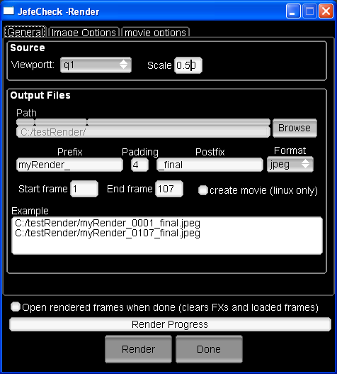

Parameters in the **Render Manager** are organized in tabs:

#### General Tab

**Source Section:**

- **Viewport** — Select the viewport you wish to render (q1, q2, q3, q4).
- **Scale** — The rendered image can be automatically scaled down by this factor: 1 is the original image, 0.5 is half, etc.

**Output Files Section:**

- **Path** — The path where the rendered images will be written. Click **Browse** to find a destination folder.
- **Prefix, Padding, Postfix, Format** — The final image names will be composed as:
  ```
  Prefix####PostFix.ext
  ```
- **Start Frame, End Frame** — Define the start and end frames to be rendered, in the same time domain as the timeline.
- **Create Movie** — Linux only. Requires `mencoder` to be installed. When checked, creates a movie called `PrefixPostfix.avi` in the output path from the rendered frames. The rendered frames will not be erased.
- **Example** — The first and last output filenames are shown here as an example of the filename generation.

#### Image Options Tab

**JPEG Section:**
- **Quality** — Compression rate; higher quality means better image fidelity but larger files.
- **Progressive** — Stores the image as a progressive JPEG. Best for viewing online or over a slow medium.
- **Optimized** — When not using Progressive mode, yields slightly smaller file sizes.

**PNG Section:**
- **Compression** — Set the compression rate for PNG output. Larger compression yields smaller file sizes but is more CPU-intensive to decode.

**TIFF Section:**
- **Compression** — Select the compression method for TIFF output (currently only LZW is available).

**OpenEXR Section:**
- **Depth** — Select the bit depth for writing (currently only Half Floating Point is available).
- **Compression** — Select the compression method:
  - Lossless: RLE, ZIP (per scanline or block), PIZ
  - Lossy: PXR24, B44 (variable bit rate and fixed rate)

#### Movie Options Tab

**Mencoder Options (Linux only):**
- **Kbits/second** — Set the desired bitrate of the output movie.
- **Codec** — Select the codec for encoding your movie. Currently only `msmpeg4` is supported and recommended, as it can be viewed on almost all Windows and Mac OS X machines.

**Open rendered frames when done** — When checked, the rendered sequence will be loaded into the selected viewport's associated track. All FXs and the previous track will be unloaded to make way for the rendered sequence.

---

### Included FXs

A list of the FXs currently installed with JefeCheck follows. More may become available online in the forums as they are developed or needed.

#### Color

- **1D LUT** — Apply a 1D LUT color transformation. Select the 1D LUT you want to use from the list.
- **3D LUT** — Apply a 3D LUT color transformation. Select the 3D LUT you want to use from the list.
- **Brightness, Contrast, Saturation** — Modify the brightness, contrast, and saturation of the image. You can also change the average luminance for the contrast operation.
- **Gamma** — Modify the gamma of the image.
- **Primary Color Correction** — Modify the brightness, contrast, and saturation of the image on a per-component basis.

#### Compositing

- **Chroma Key (Blue)** and **Chroma Key (Green)** — Do a quick blue or green screen extraction and composite. Select the bottom and top images, a bias parameter; optionally show matte only, or show the clean plate without the composite.
- **Difference Matte** — Apply a difference matte operation on two images to expose the differences between them. Select the two images to compare and a multiplier. The operation is: `absoluteValue(A-B)*multiplier`.
- **Inside** — Perform an inside composite.
- **Mix** — Mix two images together according to an amount parameter.
- **Ondita** — Proof of concept shader.
- **Over** — Perform an over composite operation. You can select the source and target image, the matte image, and the method used to extract the mask. You can also determine if the target image is premultiplied or not.
- **Split** — Split the frame between two different images. The split is performed on a slope, and the axis of the slope can also be determined. The edge of the split can also be smoothed.
- **Subtract** — Perform a subtract operation on two images.

#### Special

- **Anaglyph Color Stereo** — Create an anaglyph color stereo image from a left/right pair. Each "eye" should be loaded in a different track. The left image is colorized to cyan and the right to red; you can adjust the amount of colorizing.
- **OpenEXR** — Useful when loading HDR OpenEXR images in half-float format. Adjust the gamma and exposure of the displayed image.
- **Fields** — An animated effect. Alternates blacking out odd/even lines to achieve an interlaced look. This is not a de-interlacer — it is an aesthetic simulation.

#### Transitions

- **Fade** — An animated effect. Smoothly fades from one track to another. You can select the starting frame and the length of the fade.
- **Radial** — An animated effect. Transitions from one track to another using a growing radial matte. You can select the starting frame and length. You can also set the smoothness of the matte's edge.

---

### Creating custom 1D/3D LUTs

JefeCheck includes a few custom-made 1D and 3D LUTs, but you will most probably come across the need to use a third-party LUT or develop one yourself. This section explains how to create a JefeCheck-compatible LUT, and how to mimic any color process through JefeCheck's LUT reverse engineering.

#### 1D LUTs

1D LUTs take a single floating-point input value and output another floating-point value. When you apply a 1D LUT to an image, each color component is passed through the LUT independently. A 1D LUT can be described simply as a list of input and output numbers.

The JefeCheck 1D LUT format (`.lut` extension) is a text file containing the output values. The input values are implicitly derived from the position in the file. The file must contain the following information:

1. **Header:** `#JefeCheck LUT Header v1.0`
2. **Number of entries in the LUT** (usually 256 for 8-bit LUTs, 1024 for 10-bit, etc.)
3. **Input Bit Depth** (deprecated but still necessary for compatibility): complements the number of entries (8 for 8-bit, 10 for 10-bit, etc.)
4. **Output Bit Depth** (deprecated but still necessary for compatibility): the range of output values in bits (8, 10, 16)
5. **Entries:** The actual values. These are the output values and **must be normalized** — i.e., in the range 0.0 to 1.0. For an 8-bit LUT there would be 256 entries: the first value is the output for input 0, the second for input 1, etc., up to input 255.

Example (truncated inversion LUT):

```
#JefeCheck LUT Header v1.0
256
8
8
1.0000
0.9961
0.9922
0.9882
…
0.0078
0.0039
0.0000
```

For the complete version, see the included `invert.lut` file in your JefeCheck installation folder.

As you can see, this is an inversion LUT: low input values yield a high output and vice versa. This effectively makes a negative of the input image: white is black, black is white.

#### 3D LUTs

3D LUTs are similar to 1D LUTs in the sense that they take an input value and output another, but the input is a 3-component vector and so is the output. In practical terms, a 3D LUT converts one particular RGB color into another. This is more sophisticated than the single-component transformation performed by 1D LUTs, because complex color relationships can be defined — for example, a 3D LUT can vary the amount of green depending on the amount of red, while also taking into account how much blue there is.

A 3D LUT can be viewed as a cubical lattice, with each color sample placed on a vertex. JefeCheck works with lattices of 16×16×16 samples, giving 4096 different input and output values. When plotted on screen, the result is usually some kind of deformed "color cube" — which is why 3D LUTs are also called cubes.

JefeCheck accepts 3D LUTs in three formats:

1. **Truelight cube** — A text file with `.cub` extension. Support is still experimental and may not yield exact results.
2. **Nuke CMS color patch** — Rendered to TGA image up to size 16 (448×448 pixels). Render as TGA with linear color space conversion.
3. **JefeCheck native LUT format** — A color patch saved as an image file.

**JefeCheck Native LUT Format:**

The native LUT format consists of an image 64×64 pixels in size. Each pixel represents an entry in the 3D LUT lattice. A perfect color cube starts with pure black (0,0,0) at one corner (coordinates 0,0,0) and progresses to pure white (1,1,1) at the opposing corner (coordinates 15,15,15). Along each edge, the primary components increase gradually from 0 to 1.

This perfect color cube can be encoded into an image by "unfolding" it into 2D. If you process this image through any color pipeline, you "burn in" all the transformation. When you load it back into JefeCheck as a 3D LUT, you effectively apply all your color processing to any image in real time.

Since the canonical color patch is just an image, you can put it through any image processing pipeline (Shake, Photoshop, etc.). Open `canonicCubeImage.tga` in your software, apply color processing (only color processing — not geometric operations), and save back in TGA format.

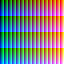

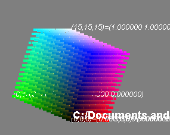 Load it back into JefeCheck and use it as a 3D LUT.

An example: taking the patch and converting it to grayscale would yield a cube where all vertices are in a single line — this is how a grayscale 3D LUT looks when visualized in JefeCheck. More extreme color processes produce more deformed cubes. You can plot any LUT directly in JefeCheck using the LUT Manager (see Visualizing LUTs).

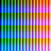

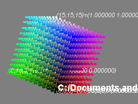

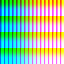

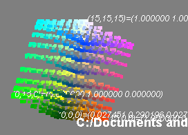

---

### Creating new FX plug-ins

Creating a new FX plug-in for JefeCheck is quite easy if you have some experience with a shading language, particularly the OpenGL Shading Language, and some knowledge of XML.

JefeCheck's FXs consist of three files:

- `file.jfx` — An XML descriptor file
- `file.frag` — An OpenGL fragment shader
- `file.vert` — An OpenGL vertex shader

The `.vert` and `.frag` files define OpenGL Shading Language vertex and fragment shaders. The `.jfx` file is a simple XML text file that describes the FX, its controls, the variables that affect the shaders, and the names of the shader files.

It is easier to understand by example. The following sections describe the MIX FX as a worked example.

#### The .jfx File Format

The `.jfx` is an XML tree with the following structure:

**`root` node:** The root node of the XML file. Must contain a `comment` attribute with whatever text you wish.

**`general` node:** Contains descriptive information on the FX in the following attributes:
- `Description` — A brief description of what the FX does (e.g., `"Blend two images together"`).
- `menuName` — The menu structure where the FX will appear in the FX Stack Control Window (e.g., `"Comp/Mix"` will make the FX appear in a submenu called **Comp** with the name **Mix**).
- `version` — The version number of the FX (e.g., `"2.0"`).
- `author` — Who wrote the FX (e.g., `"Daniel Gollas"`).
- `name` — The name that will appear in the FX Stack Manager and FX Manager windows (e.g., `"Mix"`).

**`groups` node:** Contains a series of `group` nodes, each containing controls and variables for use within the shaders. Each control group can have a name that will be displayed in the GUI.

**`group` node:** Contains a series of `widget` nodes and has a `name` attribute (e.g., `"Parameters"`).

**`widget` node:** Each widget represents a GUI element for the FX. The GUI element is linked to a uniform variable in the shaders. Available widget types:

- `float` — Creates a numeric input and passes a floating-point value to the shaders.
- `bool` — Creates a checkbox and passes `1.0` or `0.0` to the shaders.
- `texture` — Creates a selection box and passes a rectangular 2D texture sampler to the shaders. The selection box contains values A, B, C, D, and **previous**. A/B/C/D represent the image for that particular track. **previous** passes the previous FX's result to the shader — this is what allows FXs to be stacked. If you don't specify any texture widgets, the previous texture will be passed by default with the variable name `image`.
- `cube` — Creates a selection box and passes a 3D texture sampler containing a 3D LUT. The box is filled with all loaded 3D LUTs.
- `lut` — Creates a selection box and passes a 1D texture sampler containing a 1D LUT. The box is filled with all loaded 1D LUTs.
- `choice` — Creates a selection box and passes a floating-point number representing the index of the selected item. A `choice` widget must have child nodes named `choice`, each with a `label` attribute specifying the text to appear in the selection box (see `OVER.jfx` for an example).
- `newline` — Makes the following widgets appear on the next line.
- `spacer` — Creates a space between the previous widget and the next. Must have a `width` attribute specifying how much space is added.

Each `widget` node must contain these attributes (italic = optional):

| Attribute | Description |
|-----------|-------------|
| `type` | One of the widget types above (e.g., `"texture"` or `"float"`) |
| `varName` | Links the GUI to the shaders — the uniform variable with this name in your shaders will contain this widget's value |
| `label` | The label that appears in the GUI for this widget |
| `minimum` | The minimum allowed value for `float` type widgets |
| `maximum` | The maximum allowed value for `float` type widgets |
| `step` | Decimal precision for `float` type widgets (`0.1`, `0.01`, `1.0`, etc.) |
| `default` | The default value for the widget |
| `labelColorR`, `labelColorG`, `labelColorB` | Together define the label color (0–255 each) |

**`shaders` node:** Specifies the names of the shader files:
- `vertex` — Filename of the vertex shader (e.g., `"fixed.vert"`).
- `fragment` — Filename of the fragment shader (e.g., `"MIX.frag"`).

Many FXs can share the same shader files — most included FXs use the `fixed.vert` vertex shader, but each has its own fragment shader.

#### Example: The MIX FX

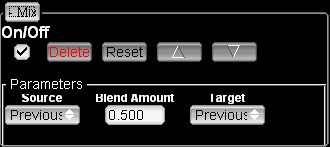

Here is the complete `MIX.jfx` file:

```xml
<?xml version = '1.0' encoding = 'UTF-8'?>
<root comment="this is the root node" >
  <general Description="Blend two images together" menuName="Comp/Mix" version="2.0" author="Daniel Gollas" name="Mix" />
  <groups>
    <group name="Parameters" >
      <widget type="newLine" varName="0" />
      <widget labelColorR="255" labelColorB="255" type="texture" default="0" label="Source" labelColorG="255" varName="first" />
      <widget labelColorR="255" labelColorB="255" type="float" step="0.001" default="0.5" label="Blend Amount" minimum="0" labelColorG="255" maximum="1" varName="Amount" />
      <widget labelColorR="255" labelColorB="255" type="texture" default="0" label="Target" labelColorG="255" varName="second" />
      <widget type="newLine" varName="0" />
    </group>
  </groups>
  <shaders vertex="fixed.vert" fragment="MIX.frag" />
</root>
```

The `general` node describes the FX. The `groups` node contains one group called "Parameters" with two `texture` widgets and one `float` widget — reflecting the FX's need to select two images and a blend amount.

#### The Vertex Shader

Most of the time you won't need to change the vertex shader unless you are familiar with vertex shaders and have a specific need. The vertex shader must at minimum pass the texture coordinates for 4 texture units to the fragment shader. The standard `fixed.vert` vertex shader is:

```glsl
void main()
{
    gl_TexCoord[0] = gl_MultiTexCoord0;
    gl_TexCoord[1] = gl_MultiTexCoord1;
    gl_TexCoord[2] = gl_MultiTexCoord2;
    gl_TexCoord[3] = gl_MultiTexCoord3;
    gl_Position = ftransform();
}
```

#### The Fragment Shader

The fragment shader is where most of the action happens, since FXs are essentially designed for 2D image processing at the pixel level. The shader receives its uniform variables from the application through the widgets declared in the `.jfx` file. Here is the `MIX.frag` fragment shader:

```glsl
uniform float Amount;
uniform sampler2DRect first;
uniform sampler2DRect second;

void main()
{
    gl_FragColor = mix(
        texture2DRect(first,  gl_TexCoord[0].st),
        texture2DRect(second, gl_TexCoord[1].st),
        Amount);
}
```

The `uniform` variables (`Amount`, `first`, `second`) receive their values from the GUI through the `varName` attributes in the `.jfx` file. The `main` function is the entry point, and the resulting pixel color must be assigned to `gl_FragColor`.

In this example, we sample the color values of the two textures using `texture2DRect`, passing the first or second sampler along with `gl_TexCoord[0]` or `gl_TexCoord[1]` respectively (this is why the vertex shader must pass the appropriate texture coordinates). Then we use the GLSL `mix` function to linearly interpolate between the two samples by the `Amount` parameter.

You should always use texture coordinate index 0 for the first declared sampler, index 1 for the second, etc.

#### Additional Uniform Variables

Aside from the uniform variables declared in your `.jfx` file, the application also provides a few additional variables. You don't have to use them, but if you do you must declare them as uniform variables in your shaders:

| Variable | Type | Description |
|----------|------|-------------|
| `texCoord0` to `texCoord4` | `vec2` | Hold the size of the four possible textures passed to the shader. |
| `currentFrame` | `float` | The current timeline value. |
| `timeStep` | `float` | Number of milliseconds since we last drew the frame. |
| `targetFPS` | `float` | The target FPS. |
| `X_size` | varies | The size for 3D LUT cube X. If your shader uses a 3D LUT variable named `myLut`, you will also receive `myLut_size` containing the size of that LUT. |

You should look at all the other included FXs to get an idea of the range of things you can do.

---

## Appendix: Screenshots

The following screenshots are from the original 2014 release and need to be updated for the current UI:

| Image | Description |
|-------|-------------|
| MainWindow.png | Main application window |
| LoadWindow.png | Load Window |
| LoadParameters.png | Load parameters (empty) |
| LoadParameters-Populated.png | Load parameters (populated with sequence info) |
| ControlBar.png | The Control Bar |
| TimeLineControls.png | Timeline and track controls |
| TrackControls.png | Track controls row |
| TrackBar.png | Track bar showing loading progress |
| trackSelectionBox.png | Track selection box in viewport controls |
| TrackLoadingMode.png | Track loading mode indicator |
| cancelLoading.png | Cancel loading button |
| StartCancelButtons.png | Start and Cancel buttons in Load Window |
| PlaybackControls.png | Playback controls |
| ViewportControls.png | Viewport controls panel |
| SingleViewportControl.png | Single viewport control panel |
| TransformationControls.png | Transformation controls (zoom, pan, rotate) |
| FlipFlopControls.png | Flip and flop controls |
| AspectControls.png | Aspect ratio controls |
| ChannelMaskControls.png | RGBA channel mask controls |
| MenuBar.png | The Menu Bar |
| PreviewInformation.png | Preview information overlay in viewport |
| PreviewText.png | Viewport text overlay during playback |
| DPXMetadata.png | DPX metadata displayed on viewport |
| CropSample.png | Crop region selection on a frame |
| LUTManager.png | The LUT Manager Window |
| grayScaleLUT.png | Grayscale 1D LUT visualization |
| GrayscaleCube.png | Grayscale 3D LUT cube visualization |
| PerfectCube.png | Perfect (unmodified) color cube visualization |
| canonicCube.png | Canonical cube visualized as a 3D cube |
| canonicCubeImage.png | Canonical cube image (the 64×64 LUT source patch) |
| ViperZodiac.png | Example test footage (Viper Zodiac) |
| ViperZodiacCube.png | Viper Zodiac image processed through a 3D LUT |
| ContrastedAndBrightened.png | Example image with contrast and brightness applied |
| ContrastedAndBrightenedCube.png | Resulting cube after contrast/brightness color correction |
| FXManager.png | The FX Manager Window |
| FXStackManager.png | The FX Stack Manager (FX Control Window) |
| DeleteFX.png | Delete FX button on an FX stack entry |
| MixGUI.png | Mix FX GUI in the FX Stack Manager |
| RemoteSessionManager.png | The Remote Session Manager Window |
| RenderWindow.png | The Render Window |
| Clipboard05.png | Playlist window screenshot |
